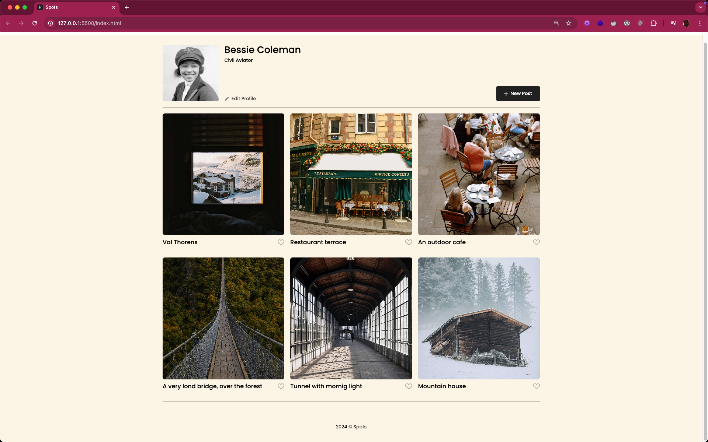
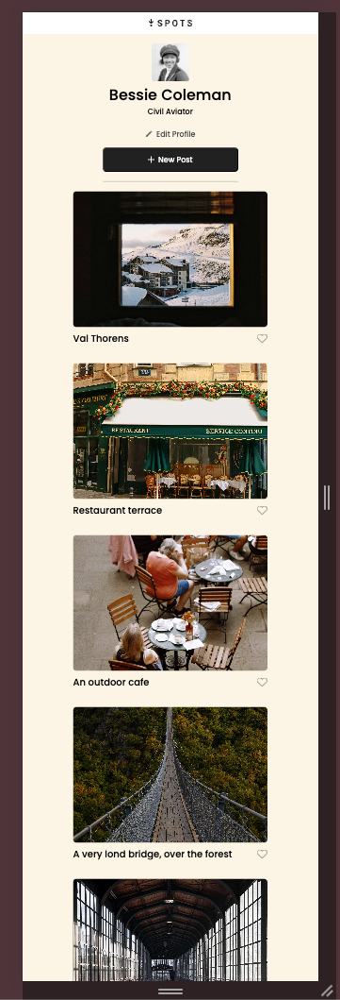

# Project 3: Spots

A social media platform to share images

## Description

This project is a social media paltform to share your iamges with the wolrd and it is basically simpel to use you need to create your profile and add your images by creating a "New post" and add a description to it and also you can edit your profile and of course people can like your images.

## Tech Stack

- HTML for markup
- CSS for styling
- GIT for version control
- GITHUB PAGES for hosting

### Figma

- [Link to the project on Figma](https://www.figma.com/file/BBNm2bC3lj8QQMHlnqRsga/Sprint-3-Project-%E2%80%94-Spots?type=design&node-id=2%3A60&mode=design&t=afgNFybdorZO6cQo-1)

### Final project

- Large screen
  
  
- Mobile view
  

### Deployment

This webpage site is deployed to Github Pages

Click here to see the project live: [Spots](https://rudyravelindev.github.io/se_project_spots/)
